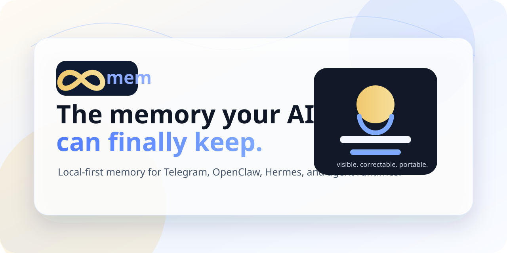

# 8mem



**The memory your AI can finally keep.**

8mem is a local-first memory layer for AI agents. It helps your assistant remember what matters, show what it knows, correct mistakes, forget stale facts, and reuse context across Telegram, OpenClaw, Hermes, and local apps.

```bash
pipx install 8mem
```

If you do not use `pipx`:

```bash
pip install 8mem
```

Created by Ashish Verma, founder of [8mem.com](https://8mem.com).

8mem source code is licensed under the Apache License, Version 2.0. The 8mem name, logo, and brand assets are brand identifiers of Ashish Verma / 8mem; the license does not grant permission to misrepresent ownership, impersonate 8mem, or use the 8mem brand in a misleading way.

## Why 8mem exists

AI is powerful, but most AI still starts from scratch.

You repeat the same context, style, preferences, corrections, names, project facts, and rules across tools. 8mem gives that context a visible, correctable, local-first home.

## What it gives you

| Capability | Common-man meaning |
|---|---|
| Visible memory | You can see what the AI remembers. |
| Correctable memory | You can fix wrong or outdated facts. |
| Forget flow | You can remove facts with confirmation and audit trail. |
| Portable context | The same memory can be reused across runtimes. |
| Local-first storage | Memory stays on your machine by default. |
| Agent adapters | Works with Telegram-first flows and can connect into OpenClaw/Hermes-style runtimes. |

## The trust loop


```text
You:   remember my launch replies should be concise
8mem:  Saved.

You:   what do you know about my launch replies?
8mem:  Your launch replies should be concise.

You:   forget my launch replies should be concise
8mem:  Forgotten.
```

## Dashboard demo


The dashboard makes memory visible: what is saved, what is being used, what changed, and what was corrected or forgotten.

## Quickstart

Install:

```bash
pipx install 8mem
```

Set up local runtime:

```bash
8mem setup --llm-model qwen2.5:14b
8mem doctor
```

Start the local UI/API:

```bash
8mem start
```

Open:

```text
http://127.0.0.1:8787
```

Stop:

```bash
8mem stop
```

## Optional semantic retrieval

8mem does not require vector search. Its core truth path is readable and local:

- Markdown memory files
- JSONL event history
- SQLite structured facts

For larger memory sets, install the optional semantic helper:

```bash
pip install "8mem[semantic]"
```

## Telegram-first memory

8mem is designed around simple language:

```text
remember I prefer short direct replies
what do you remember about me?
forget I prefer short direct replies
what changed about me?
```

Telegram setup needs your own BotFather token and a public HTTPS webhook URL if you want live Telegram delivery. Local UI/API usage works without a cloud API key.

## Runtime integrations

8mem integrates with agent runtimes by exporting current memory as context and by handling explicit memory writes.

| Runtime | Relationship |
|---|---|
| Telegram | Primary user-facing memory flow. |
| OpenClaw | 8mem provides adapter/template code; OpenClaw is separate and not bundled. |
| Hermes | 8mem provides adapter/template code; Hermes is separate and not bundled. |
| Local apps | Use the local API and context export path. |

8mem does not bundle OpenClaw or Hermes.

## Generated runtime files

8mem does not ship your runtime `AGENTS.md`, `SOUL.md`, `HEARTBEAT.md`, `MEMORY-API.md`, or machine-specific hook files.

Those files are generated locally during setup:

```bash
8mem setup --mode openclaw
8mem setup --mode hermes
```

This keeps the public repo clean and prevents private agent files, local paths, webhook secrets, or machine-specific integration state from being committed. The setup command writes only the integration block needed for that local runtime, including memory context injection, explicit remember/correct/forget handling, and webhook/callback wiring where the runtime supports it.

## Architecture

```text
User
  -> Telegram or local UI
  -> 8mem API
  -> memory service
  -> Markdown + JSONL + SQLite
  -> context export
  -> AI runtime
```

## Package contents

The public package includes:

- `src/eightmem/` product code
- UI templates and static assets
- memory templates
- OpenClaw/Hermes adapter resources
- Apache-2.0 `LICENSE`
- founder/brand `NOTICE`

It does not include private runtime data, user memory, API keys, bot tokens, local machine paths, or internal launch documents.

## Privacy model

8mem is local-first.

Runtime config is written under `~/.8mem`. User memory is stored on the user's machine by default. Telegram/OpenClaw/Hermes tokens are supplied locally by the user during setup.

## Status

8mem `0.1.5` is the first public PyPI release.

```bash
pipx install 8mem
8mem --help
```

## License

Apache License, Version 2.0. See `LICENSE` and `NOTICE`.
