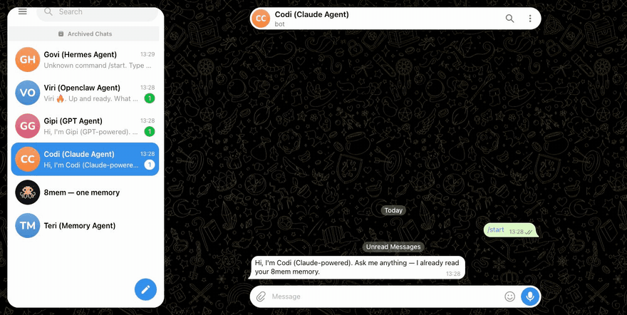
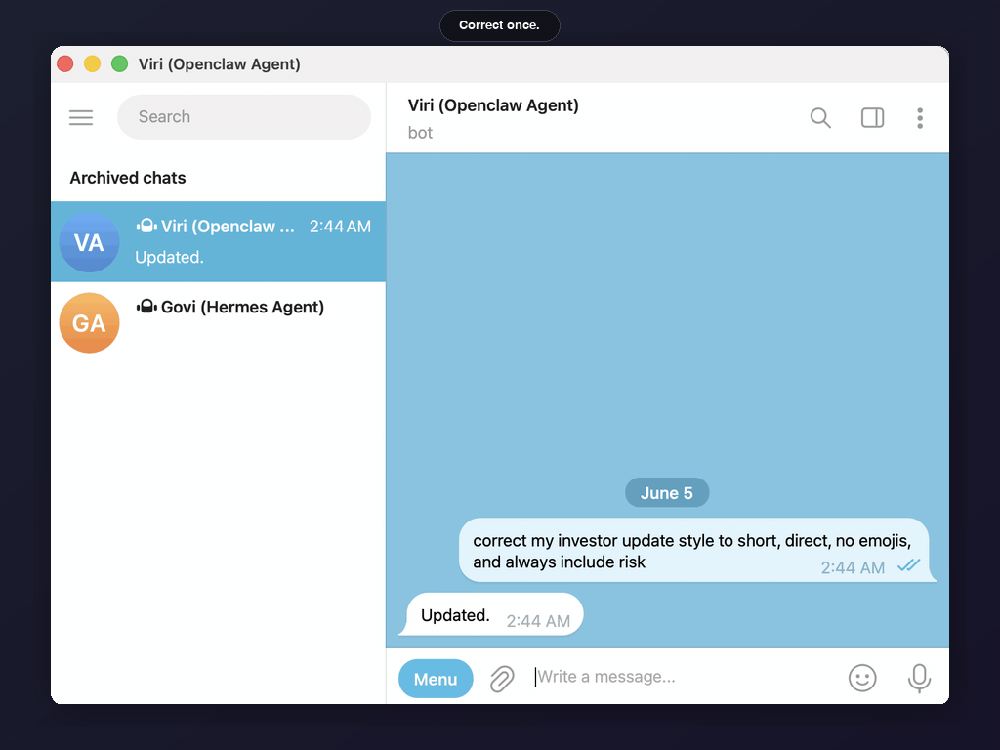
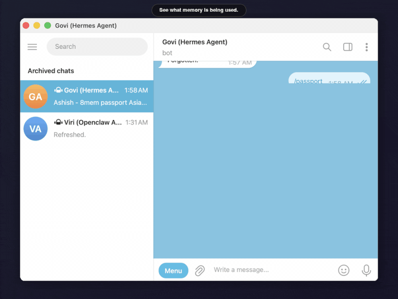
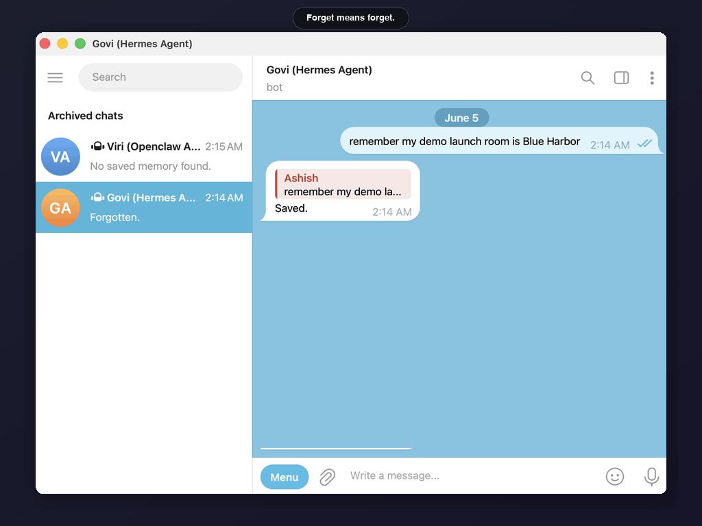
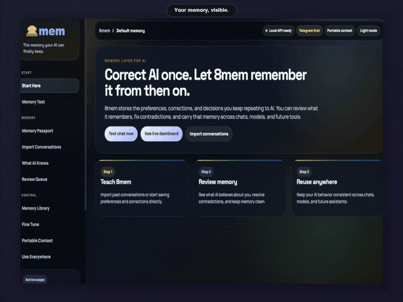

# 8mem.com

<p align="center">
  
</p>

<h2 align="center">Agent memory your AI can finally keep.</h2>

<p align="center">
  <strong>Visible. Correctable. Portable. Shared.</strong>
</p>

<p align="center">
  8mem is an agent memory layer for AI agents, agent runtimes, and developer tools.
</p>

<p align="center">
  <a href="https://8mem.com"><strong>8mem.com</strong></a> ·
  <a href="https://pypi.org/project/8mem/">PyPI</a> ·
  <a href="docs/GETTING_STARTED.md">Docs</a>
</p>

<p align="center">
  <a href="https://pypi.org/project/8mem/"></a>
  <a href="LICENSE"></a>
  
  
</p>

```bash
curl -fsSL https://8mem.com/install.sh | bash
```

AI agents can use tools, write code, browse the web, and run workflows. But across sessions and runtimes, they still forget the user, repeat stale assumptions, and hide memory inside chat history.

8mem gives agents a memory layer the user can actually inspect, correct, forget, and reuse.

It works as a standalone browser product first. Telegram, OpenClaw, and Hermes can be added when those runtimes are ready on the user's machine.

Built for people who want AI memory they can inspect, correct, and carry across agents.

## Real-Time Cross-Agent Memory



Viri is an OpenClaw agent. Govi is a Hermes agent.

8mem gives both agents the same portable memory. Save once, reuse across runtimes.

## Correct Once. Update Everywhere.



Memory should not drift silently.

8mem lets the user correct a memory, refresh the agent context, and make the updated fact available to other agents.

## Compare Generic Vs Memory-Aware Answers



The same prompt can produce a generic answer or a memory-shaped answer.

8mem Compare makes that difference visible.

## Forget Means Forget



Agent memory needs a real delete path.

When a fact is forgotten in 8mem, other agents stop using it.

## Memory Dashboard



8mem includes a local dashboard for memory visibility, review, correction, and portability.

Start it locally:

```bash
8mem start
```

Open:

```text
http://127.0.0.1:8787
```

## What 8mem Gives You

| Capability | What it means |
|---|---|
| Visible memory | See what the AI believes and uses. |
| Correctable memory | Fix wrong assumptions before they spread. |
| Forget flow | Remove stale facts with confirmation and audit trail. |
| Portable context | Reuse memory across agents, tools, and local apps. |
| User-owned storage | Keep memory under your control by default. |
| Runtime adapters | Connect memory into Telegram, OpenClaw, Hermes, and local workflows. |

## Quickstart

Recommended one-line install:

```bash
curl -fsSL https://8mem.com/install.sh | bash
```

This downloads the pinned public wheel from `8mem.com`, verifies its SHA256 checksum, installs 8mem locally, runs guided setup, and then runs `8mem doctor`.

If you already use `pipx`, install from PyPI:

```bash
pipx install 8mem
```

If you do not use `pipx`:

```bash
pip install 8mem
```

Set up local runtime:

```bash
8mem setup --llm-model <your-installed-ollama-model>
8mem doctor
```

Start local UI/API:

```bash
8mem start
```

Stop:

```bash
8mem stop
```

Need the full first-run guide?

- [Getting Started](docs/GETTING_STARTED.md)
- [Telegram Setup](docs/TELEGRAM_SETUP.md)
- [Troubleshooting](docs/TROUBLESHOOTING.md)
- [Agent Integrations](docs/INTEGRATIONS.md)
- [Uninstall And Cleanup](docs/UNINSTALL.md)

Uninstall the package:

```bash
8mem stop
pipx uninstall 8mem
```

If you installed with plain pip instead of pipx:

```bash
pip uninstall 8mem
```

8mem keeps `~/.8mem` by default so local memory is not deleted accidentally. To permanently delete local 8mem memory and runtime config:

```bash
rm -rf ~/.8mem
```

If you connected OpenClaw, remove only the 8mem-managed OpenClaw integration:

```bash
8mem uninstall --mode openclaw
```

This does not uninstall OpenClaw itself.

## Telegram-First Commands

These commands work in Telegram after BotFather token + public HTTPS webhook setup. The same memory can also be saved and inspected from the browser UI.

8mem is designed around simple memory language:

```text
remember I prefer short direct replies
what do you remember about me?
correct my update style to short and risk-aware
forget my old launch room
```

## Runtime Integrations

8mem integrates with agent runtimes by exporting current memory as context and by handling explicit memory writes.

| Runtime | Relationship |
|---|---|
| Telegram | Primary user-facing memory flow. |
| OpenClaw | 8mem provides adapter/template code; OpenClaw is separate and not bundled. |
| Hermes | 8mem provides adapter/template code; Hermes is separate and not bundled. |
| Local apps | Use the local API and context export path. |
| ChatGPT / Claude | Use exported portable context; they are not bundled inside 8mem. |

8mem does not bundle OpenClaw or Hermes.

## Generated Runtime Files

8mem does not ship your runtime `AGENTS.md`, `SOUL.md`, `HEARTBEAT.md`, `MEMORY-API.md`, or machine-specific hook files.

Those files are generated locally during setup:

```bash
8mem setup --mode openclaw
8mem setup --mode hermes
```

This keeps the public repo clean and prevents private agent files, local paths, webhook secrets, or machine-specific integration state from being committed.

The setup command writes only the integration block needed for that local runtime, including memory context injection, explicit remember/correct/forget handling, and webhook/callback wiring where the runtime supports it.

## Package Contents

The public package includes:

- `src/eightmem/` product code
- UI templates and static assets
- memory templates
- sample data for first-run browser testing
- OpenClaw/Hermes adapter resources
- Apache-2.0 `LICENSE`
- Apache-2.0 `NOTICE`

It does not include private runtime data, user memory, API keys, bot tokens, local machine paths, or internal launch documents.

## Privacy Model

8mem keeps memory under the user's control by default.

Runtime config is written under `~/.8mem`. User memory is stored on the user's machine by default. Telegram/OpenClaw/Hermes tokens are supplied locally by the user during setup.

## Status

8mem `0.1.11` is the current prepared public release.

```bash
pipx install 8mem
8mem --help
```

## License And Brand

8mem source code is licensed under the Apache License, Version 2.0. See `LICENSE` and `NOTICE`.

The 8mem name, logo, 8mem.com identity, and brand assets are brand identifiers of 8mem. The license does not grant permission to misrepresent ownership, impersonate 8mem, or use the 8mem brand in a misleading way.
