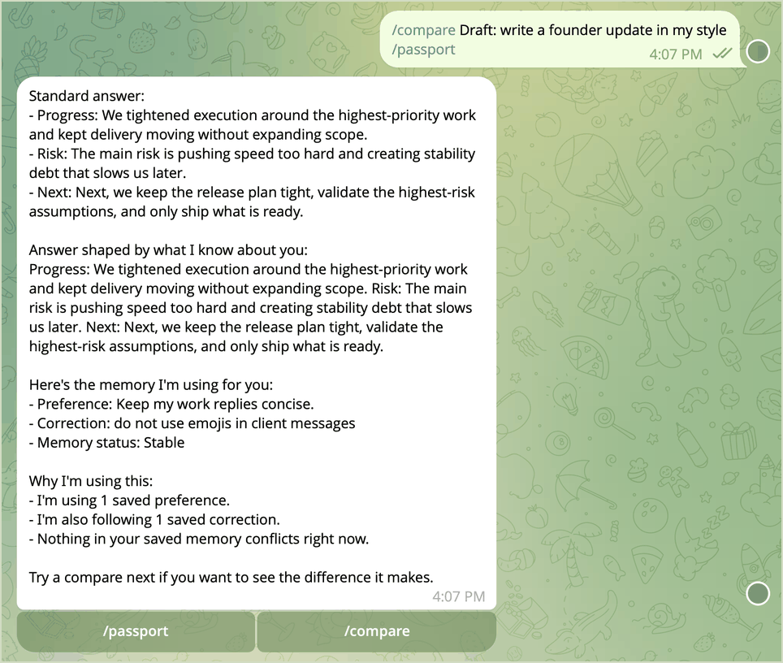
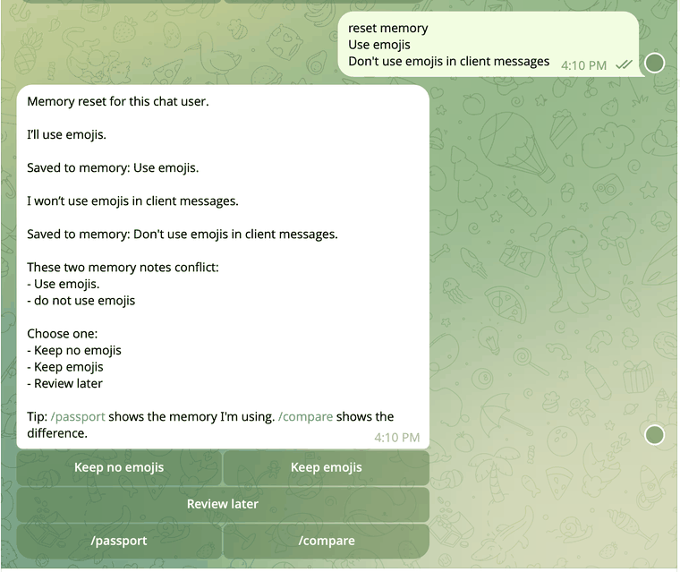
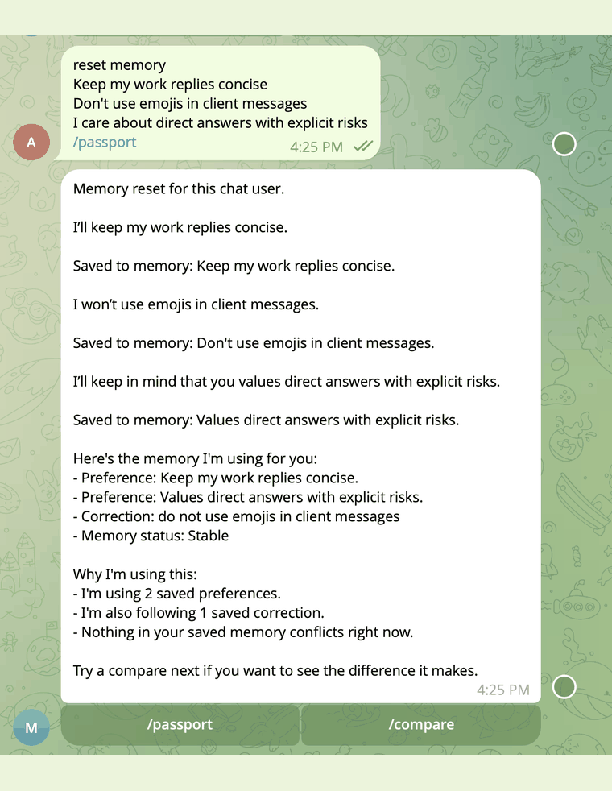
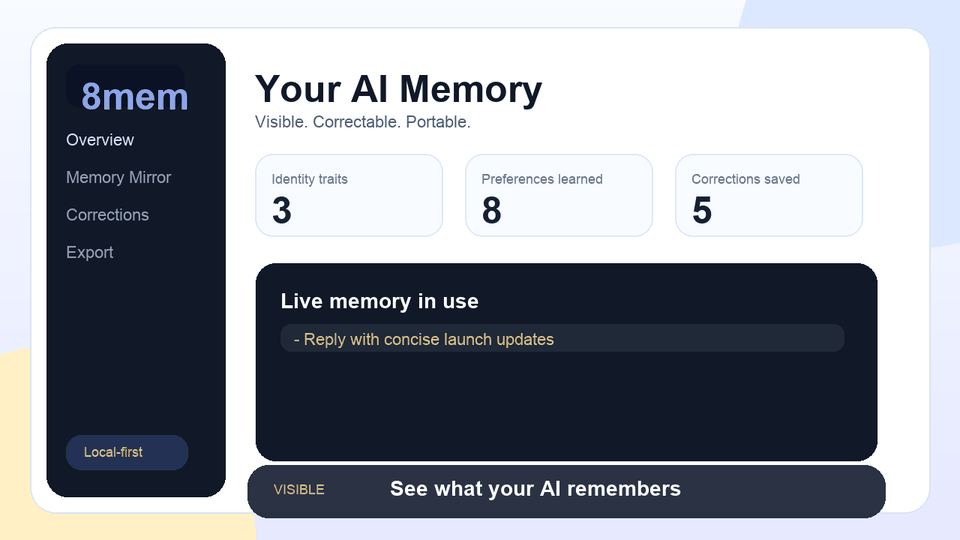
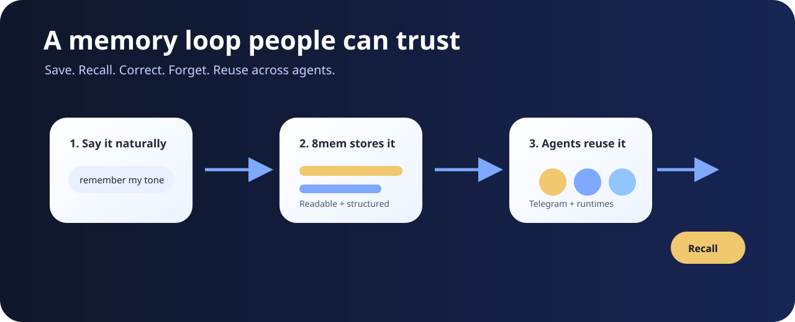

# 8mem

<p align="center">
  
</p>

<h3 align="center">The memory your AI can finally keep.</h3>

<p align="center">
  A local-first memory layer for Telegram agents, OpenClaw, Hermes, and agentic apps.
</p>

<p align="center">
  <a href="https://pypi.org/project/8mem/"></a>
  <a href="LICENSE"></a>
  
  
</p>

```bash
pipx install 8mem
```

8mem gives AI agents a visible, correctable, portable memory that lives on your machine by default.

Most assistants can chat. Most agents can use tools. But they still forget the user, repeat old mistakes, and hide stale assumptions in conversation history.

8mem adds the missing layer: memory you can see, correct, forget, export, and reuse across runtimes.

Created by Ashish Verma, founder of [8mem.com](https://8mem.com).

## See It Working In Telegram



8mem is designed around natural commands:

```text
remember I prefer short direct replies
what do you remember about me?
forget I prefer short direct replies
what changed about me?
```

The point is simple: your AI should not need the same context again and again.

## What 8mem Gives You

| Capability | What it means |
|---|---|
| Visible memory | See what the AI believes about you. |
| Correctable memory | Fix wrong assumptions before they spread. |
| Forget flow | Delete stale facts with confirmation and audit trail. |
| Portable context | Reuse the same memory across agents and apps. |
| Local-first storage | Keep memory on your machine by default. |
| Runtime adapters | Connect memory into Telegram, OpenClaw, Hermes, and local apps. |

## The Trust Loop



8mem is not just "save notes for the AI." It is a trust loop:

```text
Save a fact
  -> use it in context
  -> show what was used
  -> correct or forget it
  -> refresh the agent
```

That loop matters because memory without correction becomes silent drift.

## Memory Passport



The memory passport shows the context the agent is using: preferences, corrections, identity, decisions, and memory health.

It turns hidden personalization into something the user can inspect.

## Dashboard



The local dashboard makes memory visible: saved facts, corrections, memory state, trust controls, and exportable context.

Start it locally:

```bash
8mem start
```

Open:

```text
http://127.0.0.1:8787
```

## Quickstart

Install:

```bash
pipx install 8mem
```

If you do not use `pipx`:

```bash
pip install 8mem
```

Set up local runtime:

```bash
8mem setup --llm-model qwen2.5:14b
8mem doctor
```

Start local UI/API:

```bash
8mem start
```

Stop:

```bash
8mem stop
```

## Architecture



```text
User
  -> Telegram or local UI
  -> 8mem API
  -> memory service
  -> Markdown + JSONL + SQLite
  -> context export
  -> AI runtime
```

The core truth path is readable and local:

- Markdown memory files
- JSONL event history
- SQLite structured facts

Optional semantic retrieval is available for larger memory sets:

```bash
pip install "8mem[semantic]"
```

## Runtime Integrations

8mem integrates with agent runtimes by exporting current memory as context and by handling explicit memory writes.

| Runtime | Relationship |
|---|---|
| Telegram | Primary user-facing memory flow. |
| OpenClaw | 8mem provides adapter/template code; OpenClaw is separate and not bundled. |
| Hermes | 8mem provides adapter/template code; Hermes is separate and not bundled. |
| Local apps | Use the local API and context export path. |

8mem does not bundle OpenClaw or Hermes.

## Generated Runtime Files

8mem does not ship your runtime `AGENTS.md`, `SOUL.md`, `HEARTBEAT.md`, `MEMORY-API.md`, or machine-specific hook files.

Those files are generated locally during setup:

```bash
8mem setup --mode openclaw
8mem setup --mode hermes
```

This keeps the public repo clean and prevents private agent files, local paths, webhook secrets, or machine-specific integration state from being committed.

The setup command writes only the integration block needed for that local runtime, including memory context injection, explicit remember/correct/forget handling, and webhook/callback wiring where the runtime supports it.

## Package Contents

The public package includes:

- `src/eightmem/` product code
- UI templates and static assets
- memory templates
- OpenClaw/Hermes adapter resources
- Apache-2.0 `LICENSE`
- founder/brand `NOTICE`

It does not include private runtime data, user memory, API keys, bot tokens, local machine paths, or internal launch documents.

## Privacy Model

8mem is local-first.

Runtime config is written under `~/.8mem`. User memory is stored on the user's machine by default. Telegram/OpenClaw/Hermes tokens are supplied locally by the user during setup.

## Status

8mem `0.1.5` is the first public PyPI release.

```bash
pipx install 8mem
8mem --help
```

## License And Brand

8mem source code is licensed under the Apache License, Version 2.0. See `LICENSE` and `NOTICE`.

The 8mem name, logo, and brand assets are brand identifiers of Ashish Verma / 8mem. The license does not grant permission to misrepresent ownership, impersonate 8mem, or use the 8mem brand in a misleading way.
